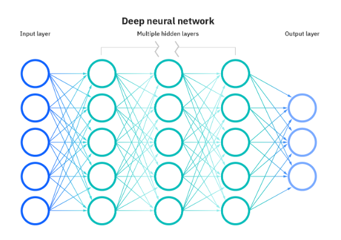
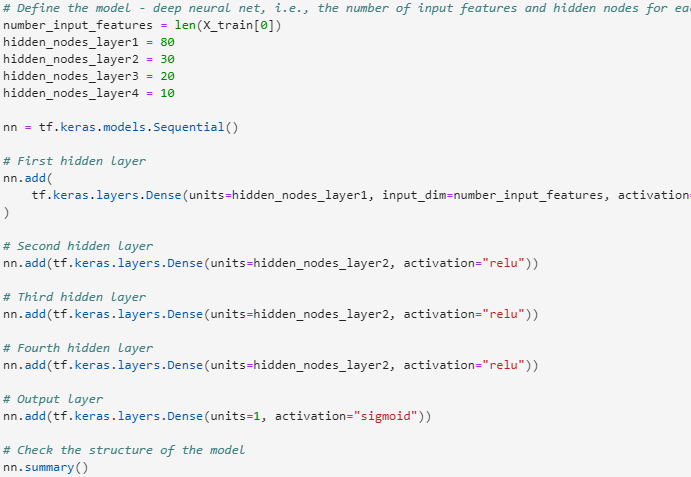
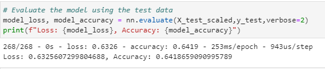
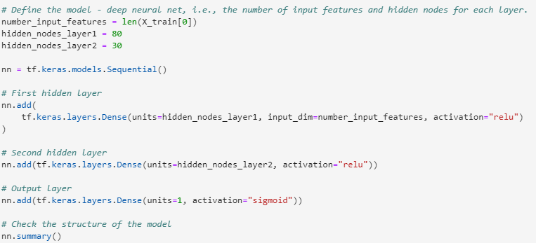
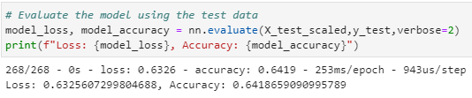

# **Neural_Network_Charity_Analysis**

## **Overview:** The purpose of this analysis is to use machine learning and neural networks to create a binary classifier to predict which applicants will be successful if funded by Alphabet Soup. 

## **Results**

** Data Preprocessing **

1. What variable(s) are considered the target(s) for your model?

The target variable I chose was *IS_SUCCESSFUL*

2. What variable(s) are considered to be the features for your model?

All columns except IS_SUCCESSFUL

3. What variable(s) are neither targets nor features, and should be removed form the input data?

*EIN* column and *NAME* are neither targets nor features and therefore were removed from the input data. 

** Compiling, Training, and Evaluating the Model **

1. How many neurons, layers, and activation functions did you select for your neural      network model, and why?

Two additional layers were added and the number of decreased to 20 for the third layer and 10 for the fourth. Since the neurons for the first are 80 and second 30 and the accuracy and loss were low, reducing the number of neurons could increase the percentages. 

2. Were you able to achieve the target model performance?

No, the closest I got was 64% accuracy.

## **Summary**
When the model is first trained with two layers, the accuracy is 50% and the loss is 170%. Training with an addition two layers, the accuracy comes out to 64% and the loss 63%. Then the two additional layers were removed and only nodes were added to the first two original layers Since the dataset is designed to come out to no more than 75%, it is safe to say, adding additional layers will not increase the accuracy to be at 75% or above. 

## **Recommendation**
Random Forest could be a good alternative since it is faster and does not require as much code as Deep Learning. 

